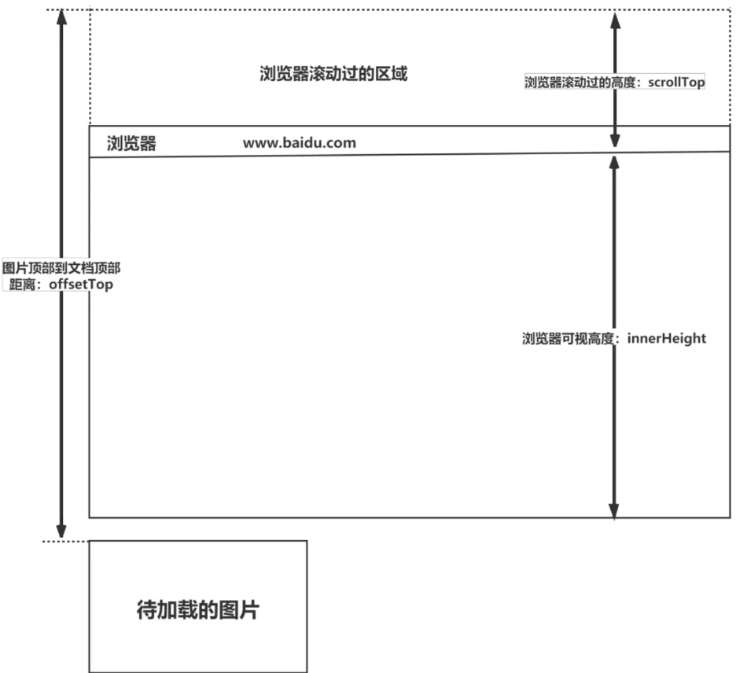

# 图片懒加载

## 介绍

传统的图片加载方式是在页面加载完成后一次性加载所有图片资源，这样会造成页面加载时间过长，带宽消耗过大，影响用户体验。
图片懒加载是一种优化网页性能的技术，它可以在网页加载时只加载当前屏幕可视区域内的图片，而不会一次性加载所有图片，从而提高网页的加载速度、减少后台服务器压力，并提升用户体验。

## 原理

懒加载的原理是通过监听用户的浏览行为，当用户滚动到可视区域内时，再进行资源的加载。这样可以避免一次性加载过多的资源，从而减少页面的加载时间和带宽消耗。

## 优点

1. 减少首页加载时间：初始页面只加载必要的内容，而不需要等待所有资源都加载完成。
2. 提高用户体验：页面加载更快，用户可以更快地交互和浏览内容。
3. 节约带宽消耗：只加载用户需要的内容，减少不必要的带宽消耗。

## 注意事项

懒加载并非适用于所有场景。对于一些重要的资源（如主要内容、重要的功能组件等），应当优先加载，以确保用户能够尽快访问到核心内容。
而对于一些非必要资源（如底部的图片、辅助功能组件等），可以采用懒加载的方式。

## 实现方案

1. 将图片的`src`属性置空，阻止图片的加载，将图片的资源路径保存在自定义的`data-src`属性上。
2. 监听图片进入视口的时刻，将图片的资源路径赋给`src`属性，进行图片的加载。

### 方式一

判断满足条件：图片顶部到文档顶部的距离<浏览器窗口滚动的距离+浏览器视口高度 && 图片顶部到文档顶部的距离+图片的高度>浏览器窗口滚动的距离

- 图片的高度：img.clientHeight
- 图片顶部到 document 顶部的距离：img.offsetTop
- 浏览器窗口滚动的距离：document.documentElement.scrollTop 或 document.body.scrollTop
- 浏览器视口高度：document.documentElement.clientHeight 或 window.innerHeight

>注：读取以上数据均会触发重排

### 方式二

借助浏览器原生提供的 [IntersectionObserver API](https://developer.mozilla.org/zh-CN/docs/Web/API/Intersection_Observer_API) 监测图片是否进入视口。

## 示例

基于`IntersectionObserver API`实现

1. 通过 IntersectionObserver()构造函数创建一个 IntersectionObserver 实例，构造函数中需要传入一个回调函数，这个函数中会将图片的资源路径赋给`src`属性。
2. 调用 IntersectionObserver 实例的 observer 方法绑定需要监听的懒加载图片元素。

<code src="./index.tsx"></code>